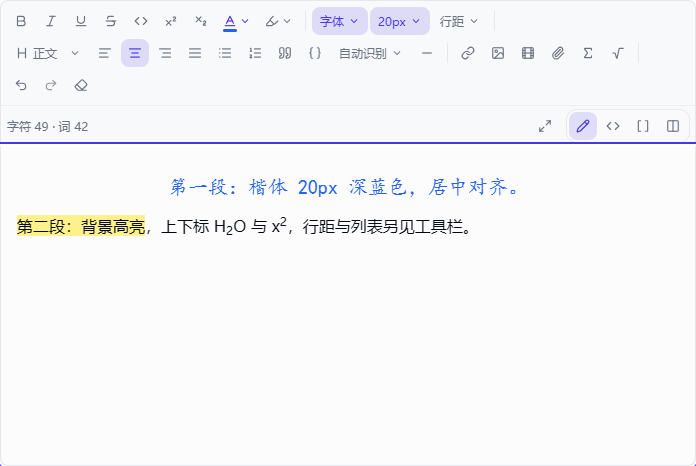
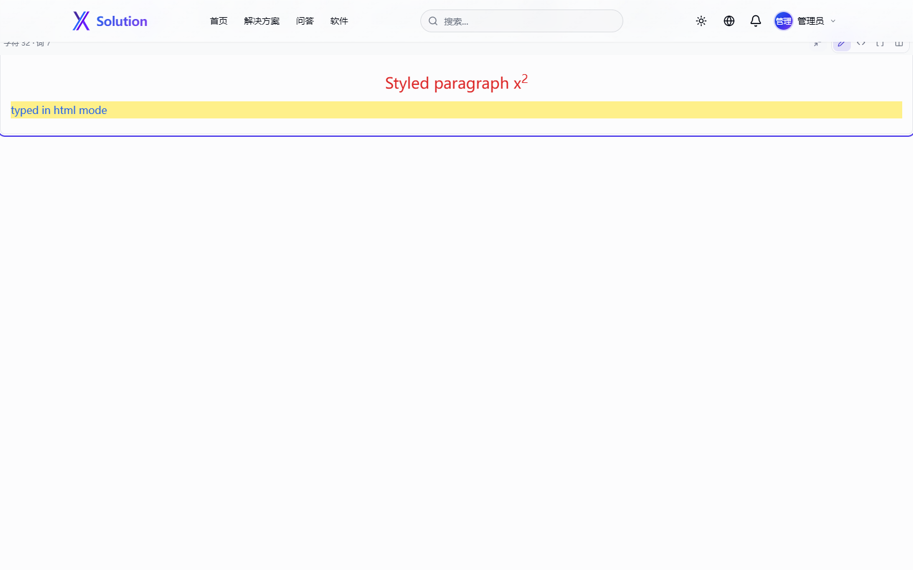

# 前端：路由、页面与组件

Next.js 15 App Router。locale 路由为 `zh`（默认，**无前缀**）/ `en`（`/en` 前缀），路由组 `(main)`、`(auth)` 不进 URL。
所有 `params` / `searchParams` 都是 **Promise**（Next 15 起），页面内 `await` 后使用。

---

## 一、路由骨架

```
src/app/
├── layout.tsx               根布局：<html lang="zh">（中文默认元数据、metadataBase、OG/Twitter 兜底）
├── icon.svg                 图标（文件约定注入 <link rel="icon">）
├── robots.ts  sitemap.ts    /robots.txt、/sitemap.xml
├── api-docs/page.tsx        /api-docs（不在 locale 下、硬编码中文、内容已过期）
├── api/                     见 api-reference.md
└── [locale]/
    ├── layout.tsx           校验 locale → NextIntlClientProvider → HtmlLang → ThemeProvider
    │                        → SessionProvider → Navbar → main → FooterClient → BackToTop → Toaster(sonner)
    │                        generateMetadata：按 locale 覆盖站点名/描述/关键词/OG
    ├── (main)/              公开页面（无自己的 layout，与 (auth) 共用上面这层）
    ├── (auth)/              login、register
    └── admin/               后台（自带 layout：回库鉴权 + noindex + force-dynamic）
```

> `(main)` 与 `(auth)` **都没有独立 layout**，因此登录/注册页也会渲染 Navbar 与 Footer。
> `FooterClient` 在路径含 `/admin` 时返回 `null`，后台不显示页脚。

---

## 二、页面清单

「模式」列：`ISR N` = `export const revalidate = N`；`FD` = `export const dynamic = "force-dynamic"`；`—` = 未声明。

### 公开页面（`(main)`）

| URL | 用途 | 数据源 | 分页 / 条数 | 模式 | 鉴权 |
|---|---|---|---|---|---|
| `/`、`/en` | 首页：Hero + 搜索 + 4 项统计 + 三类内容混合流 + 热门标签 | `article`/`question`/`software` `findMany`（各 8 条）+ `tag`（20）+ 4 个 `count` + `siteConfig` | 每类 8；标签展示 15 | ISR 300 | 公开 |
| `/solutions` | 解决方案列表：分类侧栏 + 卡片网格 | `article`（published，可按 category/tag 过滤）+ `count` + `tag` | 12/页，`?page&category&tag` | ISR 60 | 公开 |
| `/solutions/[slug]` | 详情：TOC、相关方案、正文（Markdown→HTML→高亮→净化）、投票/收藏/分享、评论 | `article` + 投票计数 + 用户投票 + 收藏 + 相关（同标签按浏览量 5 条） | 相关 5 | ISR 3600 | 阅读公开；编辑按钮仅作者/ADMIN |
| `/solutions/new` | 发布方案（客户端表单：草稿自动保存/恢复、字数统计、字段级校验、Ctrl/⌘+Enter 提交） | `POST /api/articles` | — | — | middleware 保护 |
| `/questions` | 问答列表：状态 pill（全部/open/solved） | `question` + `count` + `tag` | 15/页，`?page&status&tag` | ISR 60 | 公开 |
| `/questions/[slug]` | 问题详情 + 回答列表 + 答题框 + 相关问答 | `question` + `answer` + `vote.groupBy`（已避免 N+1）+ 收藏 + 相关（按票数 5 条） | 回答不分页；相关 5 | ISR 1800 | 阅读公开；编辑仅作者/ADMIN；采纳由提问者 |
| `/questions/ask` | 提问（同发布方案：草稿自动保存、正文计数、字段级校验、"发布须知"侧栏） | `POST /api/questions` | — | — | middleware 保护 |
| `/software` | 软件推荐：6 个分类 pill + 评分卡片 | `software`（published，按 `rating desc, createdAt desc`）+ `count` + `tag` | 12/页，`?page&category&tag` | ISR 60 | 公开 |
| `/software/[slug]` | 软件详情：星级评分、富文本介绍、信息侧栏、相关软件、评论 | `software` + 用户评分 + 收藏 + 相关（同分类按评分 5 条） | 相关 5 | ISR 3600 | 阅读公开；编辑仅作者/ADMIN |
| `/software/new` | 提交软件（同发布方案：官网链接校验、简介计数、字段级校验） | `POST /api/software` | — | — | middleware 保护 |
| `/tags/[slug]` | 标签聚合：三类内容各一段预览 + 相关标签（按共现） | `tag` + 三类 `findMany` + `count`（各取 100 个 id 算共现） | 每类 12；相关 10 | ISR 300 | 公开 |
| `/search` | 全局搜索（文章/问答/软件三段） | 三类 `contains` 查询 | 每类 10，无分页 | ISR 60（实际按请求渲染） | 公开 |
| `/profile` | 个人主页：资料、4 项统计、收藏、最近动态 | `GET /api/users/profile` | 接口返回（收藏 20、动态 10） | —（客户端） | middleware 保护 |
| `/settings` | 账户设置（`SettingsForm`：昵称/头像/简介/改密） | `auth()` + `user.findUnique`；写 `PUT /api/users/me`、`/api/users/me/password`、`POST /api/upload` | — | —（因 `auth()` 实际动态） | 页面内 `redirect("/login")` + middleware |
| `/notifications` | 通知中心：类型图标、未读数、全部已读 | `auth()` + `notification.findMany` | 50 条，无分页 | FD | 页面内 `redirect("/login")` + middleware |
| `/about`、`/privacy`、`/contact`、`/help` | 静态信息页（`/contact` 读站点配置邮箱） | `siteConfig`（仅 contact） | — | — | 公开 |

> 三个发布页的界面截图：[assets/publish-question.png](./assets/publish-question.png)（提问）、
> [assets/publish-solution.png](./assets/publish-solution.png)（发布方案）。

### 认证页面（`(auth)`）

| URL | 说明 |
|---|---|
| `/login`、`/en/login` | GitHub OAuth + 邮箱密码；`callbackUrl` 只接受站内相对路径（防开放重定向）；已登录访问会被 middleware 送回首页 |
| `/register`、`/en/register` | 前端校验与 `getRegisterSchema` 对齐（≥8 位、含字母与数字、两次一致），注册后自动登录 |

### 管理后台（`admin/`，全部 FD、全部继承 layout 鉴权）

| URL | 用途 | 分页 / 条数 |
|---|---|---|
| `/admin` | 重定向到 `/admin/dashboard`（带 locale） | — |
| `/admin/dashboard` | 6 张统计卡（含 30 天环比）、14 天活动图、待办队列、最新用户、最近审计、快捷入口 | 列表 4/5/8 条 |
| `/admin/content` | 内容管理：类型页签 + 状态筛选（带计数）+ 排序 + 搜索 + 表格 + 批量操作 | 10/页 |
| `/admin/content/[type]/[id]/edit` | 内容编辑（标题/正文/摘要/分类/状态/标签） | — |
| `/admin/comments` | 评论审核：3 个指标 + 表格 + 删除（提示回复会保留） | 20/页 |
| `/admin/users` | 用户管理：角色/状态筛选、内容数、最近登录、角色下拉、封禁/删除 | 15/页 |
| `/admin/users/[id]` | 用户详情：8 项统计、最近内容、最近评论、相关审计 | 各 5 / 8 条 |
| `/admin/tags` | 标签管理：计数漂移检测、编辑、合并、删除、重算 | 20/页 |
| `/admin/crawler` | 采集管理：源表格（启停/运行/删除）、一键全量、日志筛选与分页 | 日志 20/页 |
| `/admin/audit` | 审计日志：动作筛选 + 搜索 + 分页 | 25/页 |
| `/admin/settings` | 站点设置：名称/描述/SEO/社交/ICP/精选/三个开关 | 下拉候选各 50 |

---

## 三、middleware 守卫矩阵

`src/middleware.ts` = `auth()`（next-auth）包裹 `createMiddleware(routing)`（next-intl），顺序与规则：

1. 放行 `/api/**`、`/_next/**`、任何带扩展名的路径。
2. 先跑 i18n 中间件；若它产生重定向（带 `location`）立即返回。
3. 用 `/^\/(zh|en)(?=\/|$)/` 剥掉 locale 前缀得到「无前缀路径」——这一步是为修复当年 `/en/admin/*` 绕过守卫的漏洞。
4. 守卫规则：

| 匹配 | 未登录 | 已登录非管理员 |
|---|---|---|
| `/admin`、`/admin/**` | 307 → `{base}/login` | 307 → `{base}/` |
| `/profile`、`/settings`、`/notifications`、`/questions/ask`、`/solutions/new`、`/software/new` | 307 → `{base}/login` | 放行 |
| `/login`、`/register` | 放行 | 307 → `{base}/` |

> middleware 的 admin 判定读 **JWT 里的 `role`**（登录时冻结）；真正的兜底是 `admin/layout.tsx` 与
> `requireAdminApi()` 的**回库重读**。三层关系见 [security.md](./security.md)。

---

## 四、组件清单（48 个）

### `components/ui/`（16，Radix 封装原语）

`button`（cva + `asChild`）、`badge`、`card`、`input`、`textarea`、`label`、`select`、`dialog`、
`dropdown-menu`、`switch`、`tabs`、`toast`、`avatar`、`separator`、`skeleton`、`table`。

> `tabs.tsx` 与 `toast.tsx` **全站无引用**（实际用的是 sonner 的 `<Toaster>`），属死代码。

### `components/client/`（22，全部 `"use client"`）

| 组件 | 作用 | 主要接口 |
|---|---|---|
| `EditorToolbar` | 编辑器工具栏，分两行：上行是 `role="group"` 分组的**文字样式**（粗斜下划线删除线行内代码 + 上下标 + 文字颜色/高亮）/ **字体与间距**（字体族、字号、行距）/ **段落与列表**（段落格式下拉 H1–H6、四种对齐、列表、引用、代码块 + 代码语言、分割线）/ **插入** / **历史**；下行固定显示字符·词计数与「视图」开关（富文本 / Markdown / HTML / 分屏）。每个按钮带 `title`（含快捷键）与 `aria-label`，开关类带 `aria-pressed` | 由 `RichEditor` 传入 `editor`、`stats` 与回调 |
| `PublishShell` | 三个发布页共用的外壳：返回链接、标题与说明、页面级错误汇总、`Field`（label + 提示 + 计数器 + 字段错误，并用 `cloneElement` 把 `id`/`aria-*` 接到控件上）、草稿恢复横幅、`TipsCard`、粘性提交栏、Ctrl/⌘+Enter 提交 | — |
| `RichEditor` | Tiptap 3 富文本编辑器（所见即所得 / Markdown·HTML 源码 / 分屏预览，工具栏见 `EditorToolbar`）；**支持 LaTeX 公式**（`$…$`、`$$…$$`、`\(…\)`、`\[…\]`，输入与粘贴都会转成公式节点，双击可编辑）；**排版能力见下文「编辑器排版与三模式切换」**；同文件另导出只读 `RichContent`；可选的 `id`/`labelledBy`/`describedBy`/`invalid` 会写到可编辑区，供 `<Field>` 接上标签与错误 | `POST /api/upload` |
| `CommentSection` | 评论区：列表、发表、回复、编辑、删除 | `/api/comments*` |
| `AnswerForm` / `AnswerItem` / `AcceptButton` | 答题、展示（投票/采纳/编辑/删除）、采纳按钮 | `/api/questions/[id]/answers`、`/api/answers/[id]` |
| `VoteButtons` / `RatingWidget` / `BookmarkButton` | 顶踩投票、1–5 星评分、收藏开关 | `POST /api/votes`、`POST /api/bookmarks` |
| `ArticleEditButton` / `QuestionEditButton` / `SoftwareEditButton` | 详情页内的编辑弹窗 | 对应 `PUT /api/*/[id]` |
| `TagPicker` | 标签选择/联想 | `GET /api/tags` |
| `NotificationBell` | 导航栏通知铃铛（轮询 limit=10） | `/api/notifications*` |
| `TableOfContents` / `ReadingProgress` / `BackToTop` / `ShareButton` | 目录与滚动高亮、阅读进度、回到顶部、分享 | — |
| `ViewTracker` | 挂载后上报一次浏览 | `POST /api/views` |
| `Pagination` / `CodeBlock` | **无引用**（死代码；列表页各自实现了分页 UI） | — |

> 发布页的草稿自动保存（`localStorage`，键为 `publish:<类型>:<用户 id>`，7 天过期）与恢复横幅由
> `client/usePublishDraft.ts` 提供，属于 hook 而非组件，未计入上表；它不做 `beforeunload` 拦截——
> 内容已落盘，刷新最多丢失一个防抖窗口（800ms），回来时横幅可一键恢复。

> **客户端写操作的失败反馈（2026-10-07 修复）**：`AnswerForm` 之前只有 `if (res.ok)`、`try/finally` 没有
> `catch`，`AcceptButton`/`BookmarkButton` 同样——服务端确定会返回 400/401/404/500（例如回答短于 10 字符
> 直接 400），用户看到的是"点了没反应"外加一条未捕获的 promise rejection。现在统一用
> `src/lib/http-error.ts` 的 `readErrorMessage(res, fallback)` 取服务端已本地化的 `error` 文案：
> 表单类就地渲染 `role="alert"` 提示，按钮类走 sonner toast，网络异常回落到 `common.networkError`。

### 公式（LaTeX）

`client/math-nodes.ts`（Tiptap 节点，非 .tsx 组件）与 `lib/math.ts`（渲染）构成一条链路：

| 环节 | 行为 |
|---|---|
| 编辑 | `$…$` / `$$…$$` 输入或粘贴时由 InputRule/PasteRule 转成 `mathInline` / `mathBlock` 原子节点，`data-latex` 保存源码；双击（或回车）打开对话框编辑，工具栏有 Σ（行内）与 √（块级）两个入口 |
| 存储 | 序列化为 `<span data-math="inline" data-latex="…">` / `<div data-math="block" …>`，`data-*` 在 `sanitizeHtml` 的白名单内（`ALLOW_DATA_ATTR: true`） |
| 渲染 | `renderMathInHtml()`：先识别节点，再处理 `$…$`、`$$…$$`、`\(…\)`、`\[…\]` 文本分隔符；`<code>`/`<pre>` 内跳过，`$5 and $10` 这类价格不会被误判 |
| 顺序 | **必须先净化再渲染**：KaTeX 输出带大量内联 `style`（含 `position`、`top` 这类排版定位），先渲染再净化会被样式白名单削掉、公式排版错乱；KaTeX 用 `trust: false`，`\href` 之类不会生成链接 |
| 移动端/无服务端 | 服务端详情页（solutions/questions/software）与客户端 `RichContent`、编辑器预览共用同一函数；KaTeX CSS 在根 layout 引入（字体按需下载） |
| 回归 | `npm run math:check`（`scripts/check-math.ts`，18 个用例：分隔符、代码块跳过、价格不误判、节点往返、`trust` 关闭） |

> Markdown 模式下公式**不做 `$…$` 还原**：turndown 会转义反斜杠，`\frac{1}{2}` 会变成 `\\frac{1}{2}`（另一条
> 完全不同的、会报错的 LaTeX）。现在公式节点与样式、媒体、附件一样，以 `data-math` 原始 HTML 保留在 Markdown
> 源码里（见下节）；作者仍可手写 `$…$`，切回富文本时由输入规则转成节点。

### 编辑器排版与三模式切换（2026-10-07）

**排版能力**（`components/client/text-style-marks.ts`）：

| 能力 | 实现 | 落库形态 |
|---|---|---|
| 字体族 / 字号 / 行距 / 文字颜色 / 高亮 | `TextStyle` mark（`span` + 内联 `style`），预设见 `lib/rich-text-styles.ts` | `<span style="font-family: …; font-size: 20px; color: #2563eb">` |
| 段落对齐 | `TextAlign` 扩展用 `addGlobalAttributes` 给 `paragraph`/`heading` 加 `textAlign`，**不替换 StarterKit 的节点** | `<p style="text-align: center">` |
| 上标 / 下标 | `superscript` / `subscript` 两个 mark，互为 `excludes`，快捷键 `Ctrl+.` / `Ctrl+,` | `<sup>` / `<sub>` |
| 段落格式 | 下拉含正文与 H1–H6 | `<h1>`–`<h6>` |
| 代码块语言 | StarterKit 的 `language` 属性 + 工具栏下拉（25 种，ID 与 highlight.js 注册名一致） | `<pre class="code-block"><code class="language-js">` |
| 字符 / 词计数 | `lib/text-stats.ts`：CJK 逐字计数 + 其余按空白分词，富文本取 `editor.getText()`、源码模式取缓冲区纯文本 | 仅界面显示 |

**关键约束**：工具栏给的每个值都要先过 `filterStyleDeclarations()`（与净化器同一份白名单），通过才写入文档。
编辑器里选得出来的样式，就是发布后能存下来的样式；否则会出现"改的时候有颜色、发出去就没了"。

**样式可以落在两处**：工具栏写入的是 `TextStyle` **mark**（`<span style>`）；而粘贴/手写 HTML 常把样式写在块上
（`<p style="color: #2563eb">`、`<h2 style="text-align: center">`）。后者由 `BlockTextStyle` 用 `addGlobalAttributes`
在 `paragraph`/`heading` 上接住并原样渲染，否则"净化器接受了、过一遍富文本就没了"。工具栏显示当前值时**两处都读**
（mark 优先），否则从 HTML 源码粘进来的样式虽然生效，下拉框却还显示"字体/字号"。

**颜色比较要归一化**：ProseMirror 通过 CSSOM（`cssText`）渲染 `style`，`#dc2626` 会被写成 `rgb(220, 38, 38)`；
`normalizeCssColor()` 把两边都转成 `#rrggbb` 再比较，色板才能正确显示"当前色"。

**全屏编辑**：状态行右侧的箭头按钮把整个编辑器变成 `fixed inset-0 z-40 flex flex-col` 覆盖层（工具栏是固定头部、
当前视图自己滚动），进入时锁 `document.body` 滚动并把焦点交回可编辑区；**Esc 退出**（若公式对话框开着，
Radix 先关对话框、编辑器保持全屏）。可编辑区的内联 `min-height` 在全屏时改成 `100%`，源码/分屏文本框则改由布局控制高度。





**Markdown 源码模式的保真**（`lib/editor-markdown.ts`）：turndown 的内置规则**优先于** `keep()`，因此
`## 标题` 上的 `style="text-align: center"` 会被标题规则吃掉，附件锚点会被转成普通链接；空元素更是连规则都进不去
（`forNode()` 先判 `isBlank` → 走 `blankRule`，公式节点正是空元素）。所以：

- 用 `addRule()`（插到规则表最前）保留"带 style 的元素 / video / audio / mark / sup / sub / u / small / font /
  figure / figcaption / `a[data-attachment]` / `[data-math]`"，
- 并用 `blankReplacement` 兜住空元素，同样输出原始 HTML；
- 其余内容照常走原生 Markdown（标题、列表、粗斜体、行内代码、链接、围栏代码块都还是 Markdown）。

内联/块级原始 HTML 是 CommonMark 合法语法，`marked` 会原样透传，于是 Markdown → 富文本往返不再丢样式。
回归：`npm run markdown:check`（19 条，见 [code-audit.md](./code-audit.md) 第一节第 17 条）。

**模式切换：正在编辑的那份文本才是唯一事实来源**（`RichEditor.selectView`）。切换时先算"眼前这份内容的规范 HTML"
——富文本模式取 `editor.getHTML()`，源码/分屏模式取 `fromSource(sourceContent)`——再据此生成目标视图；
**不再从编辑器文档重新生成源码缓冲**。旧实现是从编辑器重新生成的，于是在 HTML 源码里手敲的改动会在点下
"Markdown"的一瞬间被丢掉（数据丢失，不是显示问题）。切回富文本时用
`insertContentAt(..., { applyInputRules: true })` 让 `$…$` 文本重新变成公式节点；缓冲区为空则 `clearContent()`。

**外部 `value` 同步**用"最后发出的 HTML"（`lastEmittedRef`）比对，而不是比 `editor.getHTML()`，并且源码模式下
不参与同步；这样父组件把 `onChange` 的值原样回传时不会再触发一次 `setContent`（那会清掉撤销历史）。
Tiptap 3 的 `shouldRerenderOnTransaction` 默认关闭，工具栏（含 `isActive` 状态与字体/字号标签）因此不会随光标
移动刷新，这里显式打开。

**语法高亮**（`lib/highlight.ts`）：正则原先只匹配裸 `<pre>`，而编辑器产出的是
`<pre class="code-block">`，导致编辑器写的代码块从未被高亮过；现在 `<pre>` 与 `<code>` 上的属性都会被读取，
语言类名从任一元素上取。

**源码模式提示**：HTML 模式与 Markdown 模式的文本框下方各有一行说明（`editor.htmlModeHint` /
`editor.markdownModeHint`），讲清"编辑器不支持的标签会被规范化""Markdown 表达不了的样式会以原始 HTML 保留"，
不再让作者靠猜。

### 图片、视频与附件上传（2026-10-07）

工具栏「插入」组有三个上传入口，共用一个隐藏的 `<input type="file">`（按按钮临时设置 `accept`）：

| 入口 | 接受 | 落库形态 | 详情页表现 |
|---|---|---|---|
| 插入图片 | `image/*` | `` | 直接内联，圆角阴影 |
| 插入视频 | `video/*` | `<video src controls preload="metadata">`（自定义 atom 节点） | 直接内联播放 |
| 上传附件 | PDF / 压缩包 / Office / 音频等（`UPLOAD_ACCEPT`） | `<a data-attachment data-filename data-size data-kind download>` | `renderAttachmentCards()` 展开成下载卡片 |

要点：

- **节点而非纯 HTML**：Tiptap 的 schema 里没有 `<video>` 与带元数据的附件链接，直接插 HTML 会在解析时被丢掉，
  所以新增了 `components/client/media-nodes.ts`（`VideoNode` / `AttachmentNode` 两个 atom 节点），
  序列化出来的仍是可以被净化器接受的普通 HTML。
- **插入 atom 后必须把光标移到文末**（`editor.commands.focus("end")`）：否则节点保持"被选中"状态，
  下一次插入会**替换**它（实测连续插入「附件 → 图片 → 视频」时图片会消失）。
- **上传是即时的**（发布前就上传），所以会产生"传了但没插进正文"的孤儿文件；`GET /api/attachments`
  列出本人上传、`DELETE /api/attachments/[id]` 删行加删文件。
- 客户端只 import `@/lib/upload-shared`（纯策略与嗅探）；`@/lib/upload` 含 `fs/promises`，**只能服务端引**，
  否则构建报 `Module not found: Can't parse 'fs/promises'`（实测踩过）。
- 校验矩阵、体积上限与魔数规则见 [security.md](./security.md)「上传类型矩阵」。
- 端到端验证（浏览器真实上传三种文件 → 发布 → 断言详情页）见 [code-audit.md](./code-audit.md) 第一节第 15 条。

### `components/layout/`（3）

`Navbar`（导航、搜索、主题切换、语言切换、通知、用户菜单、移动端抽屉）、`Footer`（服务端，读 `siteConfig`）、
`FooterClient`（后台隐藏页脚）。

### `components/admin/`（2）

`AdminFilters`（防抖搜索框 + 下拉筛选，写 URL query 并丢弃 `page`）、`AuditActionBadge`（审计动作徽章，
每个 action 一个显式 `case`，保证 i18n key 静态可达）。

### `components/` 根级（5）

`ThemeProvider`、`SessionProvider`、`HtmlLang`（按 locale 同步 `document.documentElement.lang`）、
`JsonLd`（服务端，`ArticleJsonLd` / `SoftwareJsonLd`，序列化时转义 `<`/`>`/`&`）、`Logo`。

---

## 五、SEO 与元数据

| 项 | 位置 | 说明 |
|---|---|---|
| `<title>` | 根 layout 给中文默认值 + `template: "%s \| Solution"`；`[locale]/layout.tsx` 按 locale 覆盖 | 站点名/描述/关键词取自 `siteConfig` 与 `common` 词条 |
| `metadataBase` | 根 layout | `NEXT_PUBLIC_SITE_URL \|\| http://localhost:3000` |
| OG / Twitter | 两处 layout | `og:locale` 按语言切换（`zh_CN` / `en_US`），`twitter:card = summary_large_image` |
| 图标 | `src/app/icon.svg` | 文件约定注入；**没有** `favicon.ico`、`apple-icon` |
| 分享图 | 两处 layout 引用 `/og-image.png` | **`public/` 下不存在该文件** → 分享图为 404（已知问题） |
| 结构化数据 | `JsonLd.tsx` | 仅 `/solutions/[slug]`（Article）与 `/software/[slug]`（SoftwareApplication）；**问答详情没有** |
| sitemap | `src/app/sitemap.ts` | `force-dynamic`；5 个静态页 + 每类最多 500 条，zh 与 en 各一套 |
| robots | `src/app/robots.ts` | 允许 `/`，禁止 `/api`、`/admin`、`/_next`、登录注册与个人页；含 sitemap 地址；后台另有 `noindex` |
| 404 | `src/app/[locale]/not-found.tsx`（2026-10-07 新增） | 此前所有 `notFound()` 都落到 Next 内置英文页且渲染在本地化 layout 之外（无导航/页脚）。现在渲染 `errors.notFoundTitle/notFoundDescription` + 回首页链接。**HTTP 状态码仍是 200**：详情页因 `auth()` 动态渲染 + 段落有 `loading.tsx`，Shell 先刷出、`notFound()` 后置，状态码已提交 —— 软 404 的成因与候选修法见 [code-audit.md](./code-audit.md) 第 2.1 节 |

---

## 六、已知行为差异（分析结论）

| # | 现象 | 说明 |
|---|---|---|
| 1 | **详情页 `revalidate` 声明基本不生效** | `/solutions/[slug]`、`/questions/[slug]`、`/software/[slug]` 都调了 `auth()`（读 cookie），实际按请求动态渲染 |
| 2 | **`settings` / `notifications` 的 `redirect("/login")` 丢 locale 前缀** | `/en` 用户被送到中文登录页；middleware 与 admin layout 都做了 `locale === "en"` 分支，只有这两处没有 |
| 3 | 全站**没有 `generateStaticParams`** | 动态段不做构建期枚举，首访走按需渲染 |
| 4 | 4 个无引用组件 | `ui/tabs`、`ui/toast`、`client/Pagination`、`client/CodeBlock` |
| 5 | 分享图与 favicon 缺失 | `/og-image.png` 被引用 4 次但文件不存在；`/favicon.ico` 也没有（标签页图标靠 `icon.svg`） |
| 6 | 问答详情缺 JSON-LD | 文章与软件有，问答没有（`QAPage`/`Question` 未实现） |
| 7 | `/admin/tags` 页码未钳制 | 其它后台列表页都会把 `page` clamp 到 `[1, totalPages]` |
| 8 | 链接库混用 | 后台已统一用 `@/i18n/routing`；前台仍有约 20 个文件直接 `import Link from "next/link"` 并手写带前缀路径 |
| 9 | `/api-docs` 页面 | 不在 locale 路由内、界面硬编码中文、端点清单已过期（见 [api-reference.md](./api-reference.md)） |
